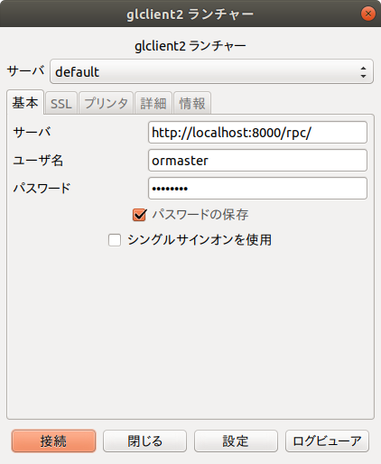
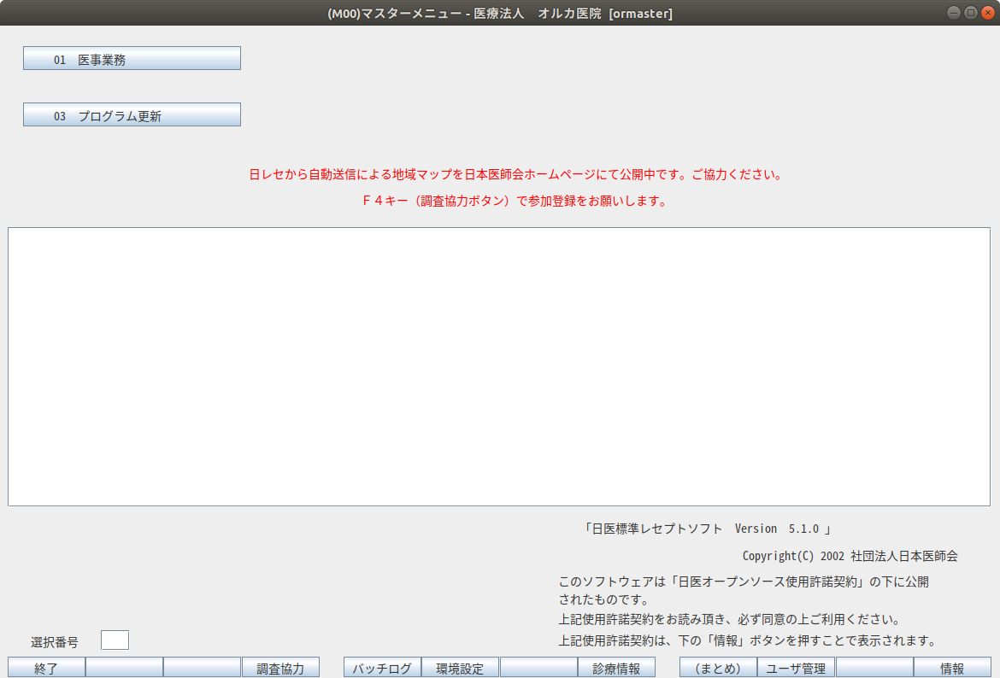

<!-- omit in toc -->
# ORCA稼働環構築手順書

jma-receipt5.1 Ubuntu18.04LTS

## 1. 作成者

酒井 陽一郎(sakai@jmedic.jp)

## 2. 改訂履歴

- 1.0:
  - 作成日時: 2021-10-14 16:58:24
  - 更新内容: 初版作成

## 3. 目次
- [1. 作成者](#1-作成者)
- [2. 改訂履歴](#2-改訂履歴)
- [3. 目次](#3-目次)
- [4. 概要](#4-概要)
- [5. 前提条件](#5-前提条件)
- [6. 作業手順](#6-作業手順)
  - [6.1. (OS)Ubuntu 18.04 LTSのセットアップ](#61-osubuntu-1804-ltsのセットアップ)
  - [6.2. (OS)インストーラーでのインストール作業（目安時間：２〜３分）](#62-osインストーラーでのインストール作業目安時間２３分)
    - [6.2.1. vmware-toolsのインストール](#621-vmware-toolsのインストール)
  - [6.3. (準備)日レセインストール用のUbuntuパッケージ設定](#63-準備日レセインストール用のubuntuパッケージ設定)
    - [6.3.1. ネットワーク設定確認](#631-ネットワーク設定確認)
  - [6.4. (準備)rootになって作業を行う](#64-準備rootになって作業を行う)
  - [6.5. (準備)キーを取得してapt-keyに追加する](#65-準備キーを取得してapt-keyに追加する)
    - [6.5.1. 結果例](#651-結果例)
  - [6.6. (準備)apt-lineに日レセパッケージ取得用のapt-lineを追加してrootでの作業を終える](#66-準備apt-lineに日レセパッケージ取得用のapt-lineを追加してrootでの作業を終える)
    - [6.6.1. 結果例](#661-結果例)
  - [6.7. (日レセ)日レセ本体(jma-receipt)のインストール](#67-日レセ日レセ本体jma-receiptのインストール)
    - [6.7.1. 結果例](#671-結果例)
  - [6.8. (日レセ)データベースのセットアップ](#68-日レセデータベースのセットアップ)
    - [6.8.1. DBエンコーディングの変更](#681-dbエンコーディングの変更)
    - [6.8.2. 日レセDBセットアップ（初期化）](#682-日レセdbセットアップ初期化)
      - [6.8.2.1. 結果例](#6821-結果例)
      - [6.8.2.2. エラーになった場合の初期化方法](#6822-エラーになった場合の初期化方法)
    - [6.8.3. データベースセットアップ後、日レセ起動、停止、起動](#683-データベースセットアップ後日レセ起動停止起動)
  - [6.9. (日レセ)ormasterパスワードの設定](#69-日レセormasterパスワードの設定)
  - [6.10. 構成内容の確認](#610-構成内容の確認)
    - [6.10.1. Ubuntu18.04LTS](#6101-ubuntu1804lts)
    - [6.10.2. jma-receiptの設定](#6102-jma-receiptの設定)
    - [6.10.3. PostgreSQLのエンコーディング設定](#6103-postgresqlのエンコーディング設定)
  - [6.11. (日レセ)日レセクライアントインストール](#611-日レセ日レセクライアントインストール)
  - [6.12. クライアントから接続できることを確認](#612-クライアントから接続できることを確認)

## 4. 概要

日医標準レセプトソフト（通称：日レセ）の稼働環境を構築するための手順書です。

VMWareの仮想マシンにUbuntu18.04LTSをインストールし、日レセ稼働環境を構築するまでを記載しています。

仮想マシンはVMWareを前提にしていますが、Hyper-V、VirturalBox等でも同様の手順になりますが、Network周りの設定だけは使用する仮想マシンマネージャによって変わりますので、適宜読み替えてください。

## 5. 前提条件

- ベースドキュメント: [「日医標準レセプトソフト Ubuntu 18.04 LTS(Bionic Beaver)のインストールドキュメント(HTML版)」](https://www.orca.med.or.jp/receipt/download/bionic/bionic_install_51.html)
- OSバージョン：Ubuntu18.04LTS（導入は仮想マシンに行う）
- 日レセバージョン：jma-receipt ver5.1 
- 準備するもの
  - [ ] [Vmware(playerでもworkstation proでも)](https://www.vmware.com/jp/products/workstation-player.html)
    - [ ] vmware仮想マシン（HDD最低20GB）
      - [ ] ネットワークアダプタの設定 nat→ブリッジ
      - [ ] OSインストール用isoイメージ [Ubuntu18.04LTS (Japanese Team版)](https://www.ubuntulinux.jp/)

## 6. 作業手順

大まかな流れ
- (OS)OSのインストールと基本的な設定
- (準備)日レセパッケージインストール用の設定
- (日レセ)日レセパッケージインストール
- (設定)各種設定

### 6.1. (OS)Ubuntu 18.04 LTSのセットアップ

- [ ] インストールイメージisoファイルを仮想マシンにマウントして立ち上げる

### 6.2. (OS)インストーラーでのインストール作業（目安時間：２〜３分）

- [ ] 言語設定：日本語
- [ ] キーボードレイアウト：日本語ー日本語
- [ ] アップデートと他のソフトウェア：
  - [ ] 通常のインストールを選択
  - [ ] その他のオプションチェックを全て外す
- [ ] ハードディスクのパーティショニング：ディスクを削除してUbuntuをインストール
- [ ] ディスクを削除してUbuntuをインストール：（ドライブはひとつだけのはず）「インストール」をクリック
- [ ] ディスクに変更を書き込みますか？：「続ける」をクリック
- [ ] どこに住んでいますか？：Tokyoになっていることを確認して「続ける」をクリック
- [ ] あなたの情報を入力してください：
  - [ ] あなたの名前：ormaster
  - [ ] コンピュータの名前：（納品用のコンピュータ名を記入：[                                 ])
  - [ ] ユーザー名の入力：ormaster
  - [ ] パスワードの入力：ormaster
  - [ ] パスワードの確認：ormaster
  - [ ] 上記の入力を確認できたら「続ける」をクリック

「Ubuntuへようこそ」の画面に切り替わり、Ubuntu18.04LTSのインストールが実行される
（目安時間：数分〜１０分程度）

- [ ] インストールが完了しました：「今すぐ再起動する」をクリック
- [ ] 「Please remove the installation medium, then reboot.」とメッセージが表示されるので、仮想マシンからインストール用isoファイルをアンマウントしてから再起動させる。
- [ ] 再起動後、GUIのログイン画面が現れたら完了

#### 6.2.1. vmware-toolsのインストール

OSインストール直後は、vmware-toolsがインストールされていないので、GUIの画面が切れて表示されたり、望みの解像度に変更出来ない場合がある
そのため、下記コマンドでvmware-toolsをインストールしておく
※以前はVMWareが提供するisoイメージをマウントしていましたが、現時点ではubuntuのパッケージが利用できます。

```Shell
sudo apt install open-vm-tools -y
```

- [ ] インストール後再起動して、自由に仮想マシンのGUI画面の大きさを変更出来ていればOK

### 6.3. (準備)日レセインストール用のUbuntuパッケージ設定

- [ ] GUIログイン画面：上で設定したユーザ名パスワードでログインする
- [ ] ターミナルを起動する：「アクティビティ」ー「端末」

今インストールしたマシン内で作業を行うのであればマシン内で上記のようにターミナルを起動する

#### 6.3.1. ネットワーク設定確認

仮想マシンのホスト、その他からssh接続して作業を行うのであれば、仮想マシンにssh接続して好みのターミナルソフトで作業しても可。その際、Ubuntuインストール直後はsshサーバがインストールされていないので、下記コマンドでインストールしてから接続する

vmwareのデフォルト設定で仮想マシンを作った場合、NICがNAT接続になっているので、仮想マシンのホスト等から接続出来ないことがあります。その場合、NICの設定を「ブリッジ」に変更してください。

```Shell
# ipアドレスの確認
ip a
# sshサーバーのインストール
sudo apt install openssh-server
```

- [ ] 仮想マシンのIPアドレス設定確認
  - [ ] OK:仮想マシンのホストからpingが飛ぶことを確認
  - [ ] NG: 一旦shutdownした後、vmware仮想マシン設定のNIC設定で「ブリッジ」に変更してから起動

以下、ターミナルでの作業

### 6.4. (準備)rootになって作業を行う

```Shell
sudo -i
```

- [ ] プロンプトが「#」になっていることを確認

### 6.5. (準備)キーを取得してapt-keyに追加する

```Shell
wget -q https://ftp.orca.med.or.jp/pub/ubuntu/archive.key
apt-key add archive.key
```

- [ ] okと表示されたことを確認

#### 6.5.1. 結果例

```Shell
root@ORCA51test:~# wget -q https://ftp.orca.med.or.jp/pub/ubuntu/archive.key
root@ORCA51test:~# apt-key add archive.key
OK
```

### 6.6. (準備)apt-lineに日レセパッケージ取得用のapt-lineを追加してrootでの作業を終える

```Shell
cd /etc/apt/sources.list.d
wget https://ftp.orca.med.or.jp/pub/ubuntu/jma-receipt-bionic51.list
apt update
apt dist-upgrade -y
exit
```

#### 6.6.1. 結果例

```Shell
root@ORCA51test:~# cd /etc/apt/sources.list.d
root@ORCA51test:/etc/apt/sources.list.d# wget https://ftp.orca.med.or.jp/pub/ubuntu/jma-receipt-bionic51.list
--2021-10-15 11:01:41--  https://ftp.orca.med.or.jp/pub/ubuntu/jma-receipt-bionic51.list
ftp.orca.med.or.jp (ftp.orca.med.or.jp) をDNSに問いあわせています... 152.199.39.108, 2606:2800:247:1cb7:261b:1f9c:2074:3c
ftp.orca.med.or.jp (ftp.orca.med.or.jp)|152.199.39.108|:443 に接続しています... 接続しました。
HTTP による接続要求を送信しました、応答を待っています... 200 OK
長さ: 244 [application/octet-stream]
`jma-receipt-bionic51.list' に保存中

jma-receipt-bionic51.list               100%[==============================================================================>]     244  --.-KB/s    時間 0s    

2021-10-15 11:01:41 (4.59 MB/s) - `jma-receipt-bionic51.list' へ保存完了 [244/244]

(-----  途中 apt update等のログ... 略)

#ここから apt updateのログ
root@ORCA51test:/etc/apt/sources.list.d# apt update
取得:1 http://ftp.orca.med.or.jp/pub/ubuntu bionic5.1 InRelease [6,126 B]
取得:2 http://ftp.orca.med.or.jp/pub/ubuntu bionic-common InRelease [6,151 B]                  
(-----  途中略 )                                                               
取得:8 http://ftp.orca.med.or.jp/pub/ubuntu bionic5.1/jma Sources [6,119 B]                                              
取得:9 http://ftp.orca.med.or.jp/pub/ubuntu bionic5.1/jma amd64 Packages [6,853 B]                                                             
取得:10 http://ftp.orca.med.or.jp/pub/ubuntu bionic5.1/jma i386 Packages [549 B]                                           
取得:11 http://ftp.orca.med.or.jp/pub/ubuntu bionic-common/jma Sources [4,423 B]         
取得:12 http://ftp.orca.med.or.jp/pub/ubuntu bionic-common/jma amd64 Packages [5,076 B]     
取得:13 http://ftp.orca.med.or.jp/pub/ubuntu bionic-common/jma i386 Packages [1,454 B]       

#ここからapt dist-upgradeのログ
root@ORCA51test:/etc/apt/sources.list.d# apt dist-upgrade
(-----  途中略 )     
取得:1 http://ftp.orca.med.or.jp/pub/ubuntu bionic-common/jma amd64 mozc-data all 2.20.2673.102+dfsg-2+jma2 [14.4 kB]
取得:2 http://ftp.orca.med.or.jp/pub/ubuntu bionic-common/jma amd64 ibus-mozc amd64 2.20.2673.102+dfsg-2+jma2 [245 kB]
取得:3 http://ftp.orca.med.or.jp/pub/ubuntu bionic-common/jma amd64 mozc-server amd64 2.20.2673.102+dfsg-2+jma2 [12.5 MB]
取得:4 http://ftp.orca.med.or.jp/pub/ubuntu bionic-common/jma amd64 mozc-utils-gui amd64 2.20.2673.102+dfsg-2+jma2 [874 kB]
13.6 MB を 2秒 で取得しました (5,766 kB/s)

(-----  以下略 )
```

上記ログ中、

- [ ] apt-lineにjma-receipt-bionic51.listが取り込まれていること
  - [ ] 「jma-receipt-bionic51.list' へ保存完了」がログにあること
- [ ] apt dist-upgradeのログでjma* [mozc|ibus]がログにあること

### 6.7. (日レセ)日レセ本体(jma-receipt)のインストール

- [ ] プロンプトが「$」になっていることを確認して以下を順に実行する

```Shell
mkdir tmp
cd tmp
sudo apt install -y jma-receipt
wget https://ftp.orca.med.or.jp/pub/etc/install_modules_for_ftp.tgz
tar xvzf install_modules_for_ftp.tgz
cd install_modules_for_ftp
sudo -u orca ./install_modules.sh
```

#### 6.7.1. 結果例

```Shell
sudo apt install -y jma-receipt
(-----  途中略  以下 日レセ関連の取得ログを示します)    
取得:2 http://ftp.orca.med.or.jp/pub/ubuntu bionic-common/jma amd64 jma-fonts all 20140325-u6jma1 [9,224 B]
取得:3 http://ftp.orca.med.or.jp/pub/ubuntu bionic5.1/jma amd64 libcob1 amd64 1.1-11+u6jma1 [79.2 kB]
取得:4 http://ftp.orca.med.or.jp/pub/ubuntu bionic5.1/jma amd64 libmondai1 amd64 1:3.0.0+p10-u6jma1 [127 kB]
取得:5 http://ftp.orca.med.or.jp/pub/ubuntu bionic5.1/jma amd64 panda-libs amd64 1:3.0.0+p43-u6jma1 [530 kB]
取得:6 http://ftp.orca.med.or.jp/pub/ubuntu bionic5.1/jma amd64 panda-server amd64 1:3.0.0+p43-u6jma1 [319 kB]
取得:7 http://ftp.orca.med.or.jp/pub/ubuntu bionic5.1/jma amd64 libcob1-dev amd64 1.1-11+u6jma1 [103 kB]
取得:8 http://ftp.orca.med.or.jp/pub/ubuntu bionic5.1/jma amd64 open-cobol amd64 1.1-11+u6jma1 [215 kB]
取得:9 http://ftp.orca.med.or.jp/pub/ubuntu bionic5.1/jma amd64 libgtkpanda2.0-0 amd64 2.0.6+p2-u6jma1 [156 kB]
取得:10 http://ftp.orca.med.or.jp/pub/ubuntu bionic5.1/jma amd64 libglade-panda2.0-0 amd64 2.0.5+p0-u6jma1 [90.0 kB]
取得:11 http://ftp.orca.med.or.jp/pub/ubuntu bionic5.1/jma amd64 panda-dev amd64 1:3.0.0+p43-u6jma1 [104 kB]
取得:12 http://ftp.orca.med.or.jp/pub/ubuntu bionic5.1/jma amd64 monpe-freetype amd64 2.5.2-1ubuntu2.5+u6jma1 [395 kB]
取得:13 http://ftp.orca.med.or.jp/pub/ubuntu bionic5.1/jma amd64 monpe-common all 0.6.21+p0-u6jma1 [1,187 kB]
取得:14 http://ftp.orca.med.or.jp/pub/ubuntu bionic5.1/jma amd64 monpe-libs amd64 0.6.21+p0-u6jma1 [682 kB]
取得:15 http://ftp.orca.med.or.jp/pub/ubuntu bionic5.1/jma amd64 monpe amd64 0.6.21+p0-u6jma1 [221 kB]
取得:16 http://ftp.orca.med.or.jp/pub/ubuntu bionic-common/jma amd64 orca-ca-cert amd64 1.2-u6jma1 [5,056 B]
取得:17 http://ftp.orca.med.or.jp/pub/ubuntu bionic5.1/jma amd64 jma-receipt amd64 1:5.1.0-u6jma1 [32.5 MB]

(-----  途中略 )    

jma-receipt (1:5.1.0-u6jma1) を設定しています ...
Adding system group: orca.
グループ `orca' (GID 1001) を追加しています...
完了。
Adding system user: orca.
Adding system group: postorca.
グループ `postorca' (GID 1002) を追加しています...
完了。
ユーザ orca をグループ postorca に追加
ユーザ postgres をグループ postorca に追加
ユーザ orca をグループ lpadmin に追加
Copying scripts files...done
Copying lddef files...done
Copying data files...done
Copying etc files...done
gpg: ディレクトリ'/home/orca/.gnupg'が作成されました
gpg: keybox'/home/orca/.gnupg/pubring.kbx'が作成されました
gpg: /home/orca/.gnupg/trustdb.gpg: 信用データベースができました
gpg: 鍵1A033BA9ED7FC485: 公開鍵"support (plugin) <support@orca.med.or.jp>"をインポートしました
gpg: 処理数の合計: 1
gpg:               インポート: 1
(-----  以下略 )  
```

### 6.8. (日レセ)データベースのセットアップ

日レセではデータベースにPostgresqlを利用しています。
日レセパッケージのインストール時にPostgresqlもインストールされるので、設定を行います。

#### 6.8.1. DBエンコーディングの変更

エンコーディングをUTF-8に変更します。

```Shell
#設定ファイルにエンコーディング情報を設定
sudo sh -c 'echo DBENCODING=\"UTF-8\" > /etc/jma-receipt/db.conf'
#設定ファイルの確認
cat /etc/jma-receipt/db.conf
#以下の表示が出ればOK
DBENCODING="UTF-8"
```

#### 6.8.2. 日レセDBセットアップ（初期化）

```Shell
sudo jma-setup
```

##### 6.8.2.1. 結果例

```Shell
ormaster@ORCA51test:~/tmp$ sudo jma-setup
DBHOST:		OK (PostgreSQL:localhost)
DBUSER:		OK (orca)
DATABASE:	CREATEDB (orca)
DBENCODING:	OK (UTF-8)
DBKANRI		CREATE TABLE (tbl_dbkanri)
UPDATE CHECK:	OK (online)
DBLIST:		OK (050100-1)
LIST DOWNLOAD:	FILE (1)
DOWNLOAD:	.OK
EXTRACT:	.OK
UPDATE:		.OK
DBVERSION:	OK (0501001)
データベース構造変更処理は終了しました
```

##### 6.8.2.2. エラーになった場合の初期化方法

- （例）エンコーディングを変更せずにjma-setupを流した場合

```Shell
ormaster@ORCA51test:~/tmp$ sudo jma-setup
DBHOST:		OK (PostgreSQL:localhost)
DBUSER:		OK (orca)
DATABASE:	OK (orca)
DBENCODING:	OK (EUC-JP)
DBKANRI		OK (tbl_dbkanri)
UPDATE CHECK:	ERROR: センタからのDBレコード管理情報のダウンロードに失敗しました
(/usr/lib/jma-receipt/init/orca-db-install.sh)
ERROR: データベース構造変更処理は異常終了しました。

```

- （例）既にDBセットアップが終わってorcaDBが存在する状態でjma-setupを流した場合（存在するデータベースのエンコードがEUC-JPの場合のエラー例です）

```Shell
ormaster@ORCA51test:~/tmp$ sudo jma-setup
DBHOST:		OK (PostgreSQL:localhost)
DBUSER:		OK (orca)
DATABASE:	OK (orca)
DBENCODING:	ERROR: encoding error Database( EUC_JP) != DBENCODING(UTF-8)
(/usr/lib/jma-receipt/init/orca-db-create.sh)
ERROR: データベース構造変更処理は異常終了しました。
```

このような場合には一旦DBを削除してから再度初期化します。
DBを初期化する手順は下記の通り

```Shell
#jma-receipt停止
sudo systemctl stop jma-receipt
#db削除
sudo -u orca dropdb orca
#もう一度db削除を行って、「そのようなdatabaseはない！」と怒られればOK
sudo -u orca dropdb orca
dropdb: database removal failed: ERROR:  database "orca" does not exist
```

#### 6.8.3. データベースセットアップ後、日レセ起動、停止、起動

初回起動時にエラーになることがあるとの記述があるので、下記のように起動〜停止〜起動させる

```Shell
sudo systemctl start jma-receipt
sudo systemctl stop jma-receipt
sudo systemctl start jma-receipt
```

### 6.9. (日レセ)ormasterパスワードの設定

```Shell
sudo -u orca /usr/lib/jma-receipt/bin/passwd_store.sh
```

- ここで設定したormasterは日レセクライアントで接続する時に使用するユーザ名/パスワードになります
- 追加のユーザは[01 医事業務]→[91 マスタ登録]→[101 システム管理マスタ]→管理コード[1010 職員情報]から作業

### 6.10. 構成内容の確認

ここまでの手順で日レセサーバとしてのセットアップは完了で、以下のような内容で構成されました。

#### 6.10.1. Ubuntu18.04LTS

[6.2. (OS)インストーラーでのインストール作業（目安時間：２〜３分）](#62-osインストーラーでのインストール作業目安時間２３分)で設定した、Ubuntuにログインするためのユーザー/パスワード

メンテナンスのためにsshで接続する時等に使用します

| Ubuntu18.04の設定    |                 |
|-------------------|-----------------|
| IP address        |  [6.3.1. ネットワーク設定確認](#631-ネットワーク設定確認)において、「ip a」で確認したアドレス |
| ユーザー              | ormaster        |
| パスワード             | ormaster        |

#### 6.10.2. jma-receiptの設定

- [6.9. (日レセ)ormasterパスワードの設定](#69-日レセormasterパスワードの設定)で設定した日レセにログインするためのデフォルトユーザー/パスワード。
- glclient2,monsiaj等の日レセクライアントで接続する時に使用します。

| jma-receiptの設定    |                 |
|-------------------|-----------------|
| バージョン             | 5.1             |
| ログイン用ユーザー         | ormaster        |
| パスワード             | ormaster        |

#### 6.10.3. PostgreSQLのエンコーディング設定

| db(Postgresqlの設定) |                 |
|-------------------|-----------------|
| db-encoding       | UTF-8           |

### 6.11. (日レセ)日レセクライアントインストール

```Shell
sudo apt install -y panda-client2
```

### 6.12. クライアントから接続できることを確認

仮想マシンのglcient2若しくは、他のマシンのmonsiajクライアントで、これまでに設定した日レセに接続する

- サーバ欄の[localhost]の部分は仮想マシン内でglclientを起動する場合にはそのまま、他のマシンから接続する場合は、上のサーバーIPaddressを設定する
- ユーザー名パスワードはこれまでに設定した内容で接続する



- [ ] 下記画面が表示されればOK

